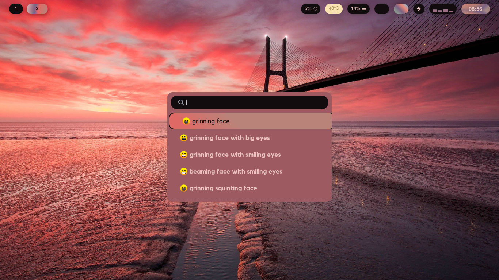
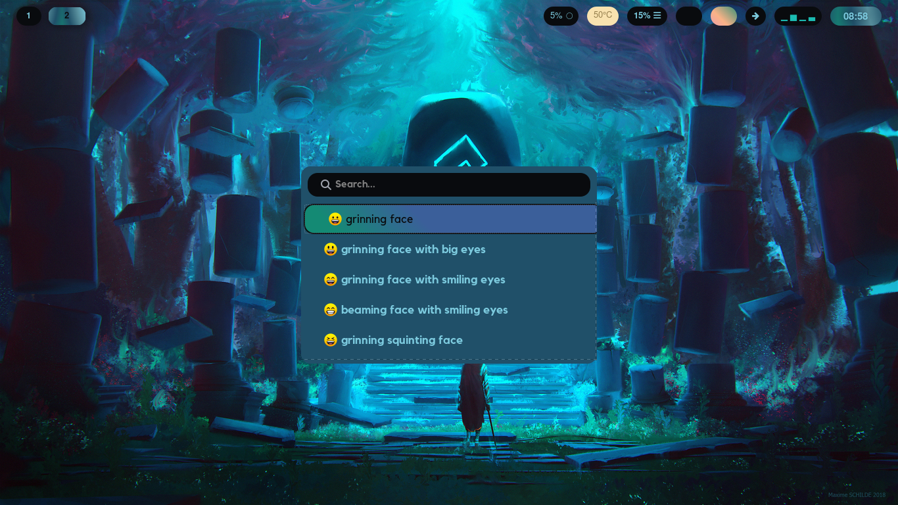

# Intro
This is a simple configuration for my wofi styling that is based off of <a href=“https://github.com/flick0/dotfiles”>flick0</a> to suit my preferences a bit better. Its rather simple since all it does is inherit the colors from pywal generated colors stored on ~/.cache/wal/

It imports the colors from the colors.scss file in the pywal cache directory, since this file changes each time when switching the wallpapers it is necessary to regenerate style.css from the style.scss 

# Dependancies 
In addition to the ones provided by flick0
- pywal - for changing the colors
- sass - since its written in scss

# Modifications to the original
I mostly just wanted to have the desktop colors change per the wallpaper

## Waybar

Added style.scss which is where the modifications and color imports are done.
Once the config changes waybar is relaunched.

## Wofi

Added style.scss which is where the modifications and color imports are done.
Once the config changes the changes are evident in the next wofi launch.

## Zathura

Added a new function gengenzathurarc modified from <a href=“https://github.com/GideonWolfe/Zathura-Pywal.git”>Zathura-Pywal</a> so that it only requires one script to work. This script generates a new zathurarc config saving the existing one as zathurarc.old. To see the change you would need to open zathura. I didnt know if it was possible to reload it at the time of uploading.

## wall

I made a small change to the wall script that changes the wallpaper.
- Added the wofi and waybar sass commands to make the css changes.
- Added the zathurarc generator
- Waybar relaunch / reload

# Examples
- 
- 
- 
- 
- 
