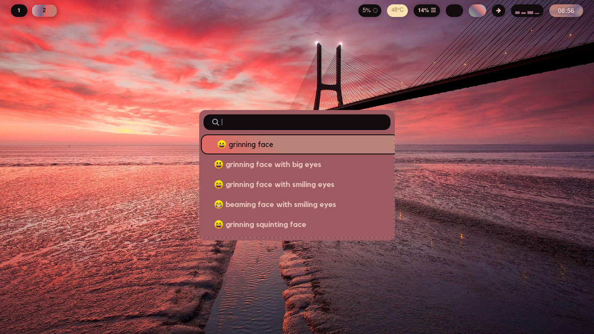
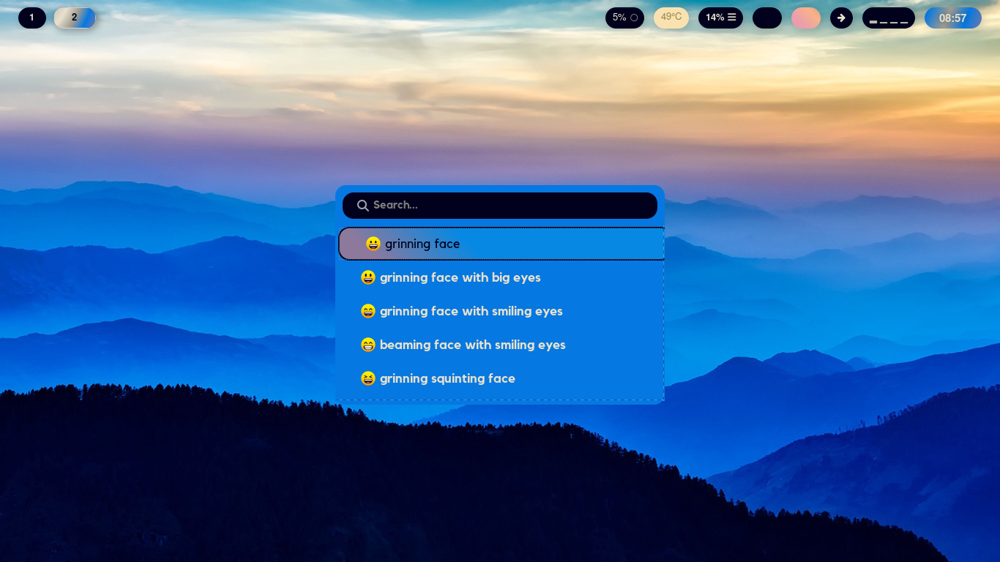
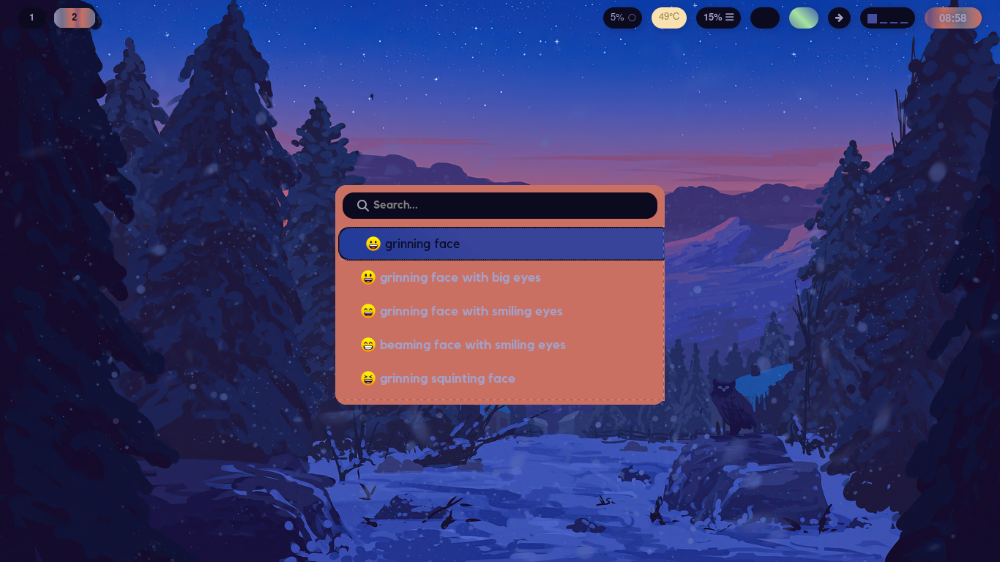
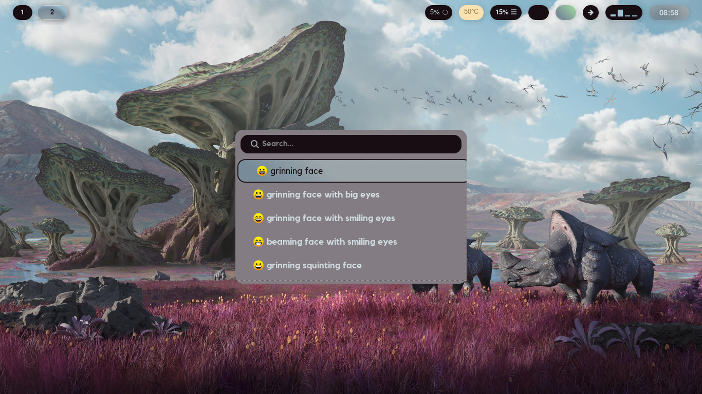
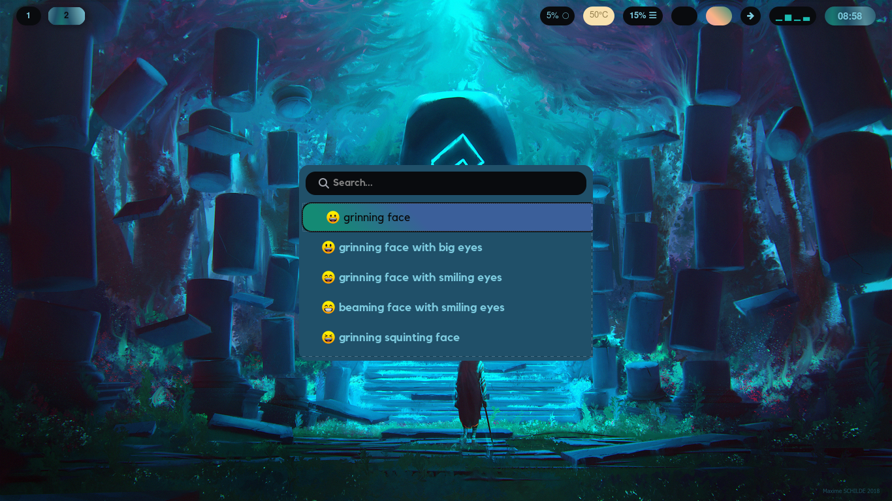
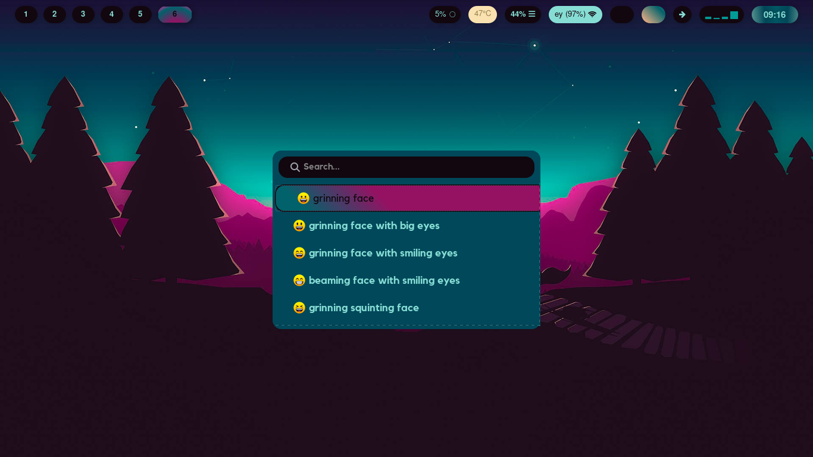

# Intro - just a rehash of the hypr one
This is a simple configuration for my wofi styling that is based off of <a href=“https://github.com/flick0/dotfiles”>flick0</a> to suit my preferences a bit better. Its rather simple since all it does is inherit the colors from pywal generated colors stored on ~/.cache/wal/

It imports the colors from the colors.scss file in the pywal cache directory, since this file changes each time when switching the wallpapers it is necessary to regenerate style.css from the style.scss 

# Dependancies 
In addition to the ones provided by flick0
- pywal - for changing the colors
- sass - since its written in scss

# Examples
- 
- 
- 
- 
- 
- 

